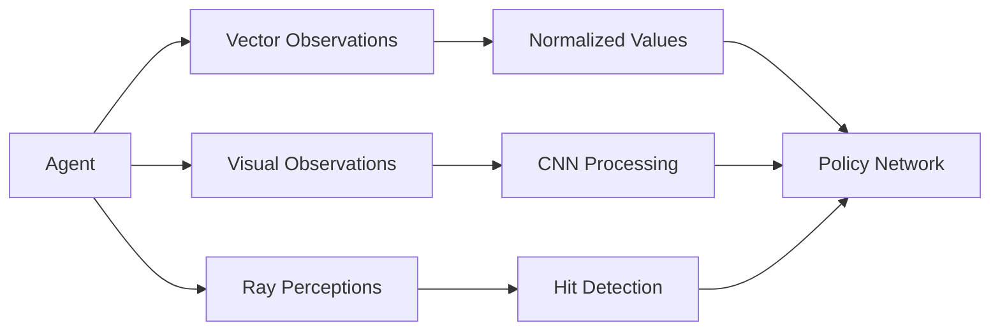

# ML-Agents Architecture Documentation

This directory contains architecture diagrams and flow documentation for the Unity ML-Agents Toolkit.

## System Overview

### High-Level Architecture


The ML-Agents Toolkit consists of three main components:

1. **Unity Environment**: Where agents interact with the simulation
   - Unity scenes with ML-Agents Academy
   - Agents with Behavior Parameters
   - Sensors (Vector, Visual, Ray Perception)
   - Actuators (actions)

2. **Communication Layer**: gRPC-based protocol
   - Bidirectional communication between Unity and Python
   - Observations flow from Unity to Python
   - Actions flow from Python to Unity
   - Rewards and episode termination signals

3. **Python Training**: Where learning happens
   - Training algorithms (PPO, SAC, MA-POCA)
   - PyTorch neural networks
   - TensorBoard monitoring
   - Model checkpointing and ONNX export

## Training Pipeline


### Training Flow

1. **Initialization**
   - User runs `mlagents-learn` with configuration
   - Environment Manager launches Unity process(es)
   - gRPC connection established

2. **Training Loop**
   ```
   Unity → Observations → Trainer → Neural Network → Actions → Unity
                ↓
            Experience Buffer
                ↓
         Gradient Updates
                ↓
            TensorBoard
   ```

3. **Checkpointing**
   - Periodic model saves
   - ONNX exports for Unity deployment
   - Training state preservation

4. **Shutdown**
   - Graceful termination
   - Final model export
   - Results saved to disk

## Inference Flow


### Runtime Inference in Unity

1. **Agent** collects observations via **Sensors**
2. Observations normalized and fed to **Inference Engine**
3. Inference Engine runs ONNX model
4. Actions sampled from model output
5. Actions applied via **Actuators**
6. Agent receives next observation

**Key Points:**
- No Python required at runtime
- ONNX models run natively in Unity
- Inference can use GPU or CPU
- Optimized for real-time performance

## Component Details

### Unity Components

#### Academy
- Central coordinator for all agents
- Manages environment parameters
- Handles episode lifecycle
- Communicates with Python trainer

#### Agent
- Individual learning entity
- Implements observation collection
- Executes actions
- Computes rewards
- Example: `public class MyAgent : Agent { ... }`

#### Sensors
- **VectorSensor**: Numerical observations (position, velocity, etc.)
- **CameraSensor**: Visual observations (pixels)
- **RayPerceptionSensor**: Raycasts for object detection

#### Behavior Parameters
- Links agent to model
- Defines observation/action spaces
- Sets inference vs training mode
- Specifies decision frequency

### Python Components

#### UnityEnvironment
```python
from mlagents_envs.environment import UnityEnvironment
env = UnityEnvironment(file_name="path/to/build")
```
- Manages Unity process lifecycle
- Handles gRPC communication
- Provides gym-like interface

#### Trainers
- **PPO**: Proximal Policy Optimization (default)
- **SAC**: Soft Actor-Critic (continuous control)
- **MA-POCA**: Multi-Agent Cooperative/Competitive

#### Neural Network
- PyTorch models
- Configurable architecture (hidden units, layers)
- Support for LSTM (memory)
- Exports to ONNX for Unity

## Data Flow

### Observation Types



### Action Types

- **Discrete Actions**: Categorical choices (e.g., move left/right/forward)
- **Continuous Actions**: Real-valued actions (e.g., motor torques)
- **Multi-discrete**: Multiple categorical actions
- **Hybrid**: Mix of discrete and continuous

### Reward Design

```
Total Reward = Extrinsic + Intrinsic
             = Environment Rewards + Curiosity/GAIL
```

## Deployment Options

### 1. Training Mode
```
Unity ←gRPC→ Python Trainer → Neural Network → ONNX Export
```

### 2. Inference Mode (Runtime)
```
Unity → ONNX Model (Inference Engine) → Actions
```

### 3. Heuristic Mode (Manual Control)
```
Unity → Manual Controls → Actions
```

## Communication Protocol

### gRPC Messages

**Unity → Python:**
```protobuf
ObservationProto {
  float[] vector_observations
  bytes[] visual_observations
  float reward
  bool done
}
```

**Python → Unity:**
```protobuf
ActionProto {
  float[] continuous_actions
  int32[] discrete_actions
}
```

## Performance Considerations

### Training Performance
- **Parallel Environments**: Run 4-8 Unity instances
- **Batch Size**: 1024-4096 for GPU efficiency
- **Time Horizon**: 64-128 steps per update
- **GPU Usage**: PyTorch training on CUDA

### Inference Performance
- **Decision Frequency**: Don't request decisions every frame
- **Model Size**: Smaller networks (64-128 hidden units)
- **ONNX Optimization**: Compiled for target platform
- **GPU Inference**: Use GPU backend in Unity if available

## External Dependencies

### Python Training
- **PyTorch**: Neural network framework
- **gRPC**: Communication protocol
- **TensorBoard**: Visualization
- **NumPy**: Numerical operations
- **ONNX**: Model export format

### Unity Runtime
- **ML-Agents Package**: Unity C# SDK
- **Sentis (Inference Engine)**: ONNX runtime
- **Unity Input System**: Action handling (optional)

## Directory Structure

```
ml-agents/
├── ml-agents/              # Python training package
│   ├── trainers/          # Training algorithms
│   ├── torch_entities/    # Neural network models
│   └── plugins/           # Extensibility system
├── ml-agents-envs/        # Unity environment interface
│   ├── environment.py     # UnityEnvironment class
│   └── rpc/              # gRPC communication
├── com.unity.ml-agents/   # Unity package
│   ├── Runtime/          # Agent, Academy, Sensors
│   └── Editor/           # Unity Editor integration
└── Project/              # Example Unity project
    └── Assets/ML-Agents/Examples/
```

## Further Reading

- [Unity ML-Agents Documentation](https://docs.unity3d.com/Packages/com.unity.ml-agents@latest)
- [Training Configuration Reference](https://docs.unity3d.com/Packages/com.unity.ml-agents@latest/index.html?subfolder=/manual/Training-Configuration-File.html)
- [Python API Documentation](https://docs.unity3d.com/Packages/com.unity.ml-agents@latest/index.html?subfolder=/manual/Python-LLAPI.html)
- [AGENTS.md](../../AGENTS.md) - Development workflow guide
